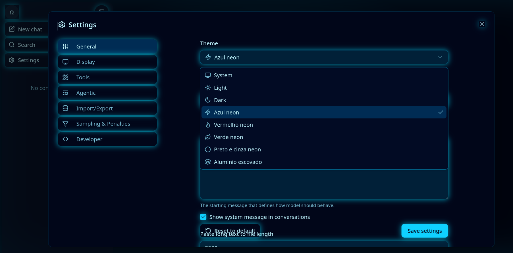
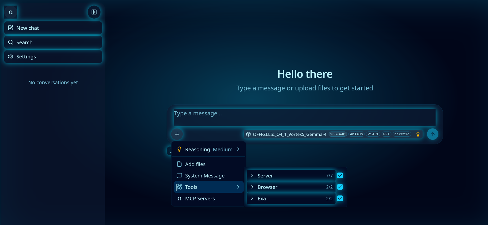
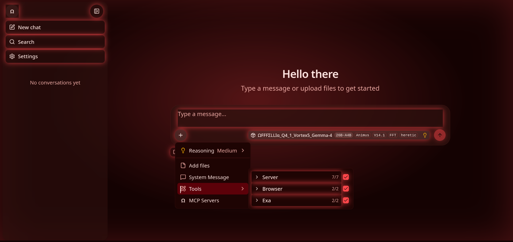
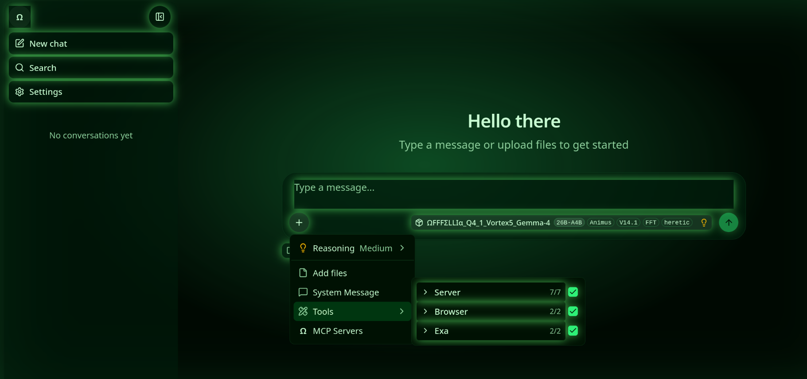
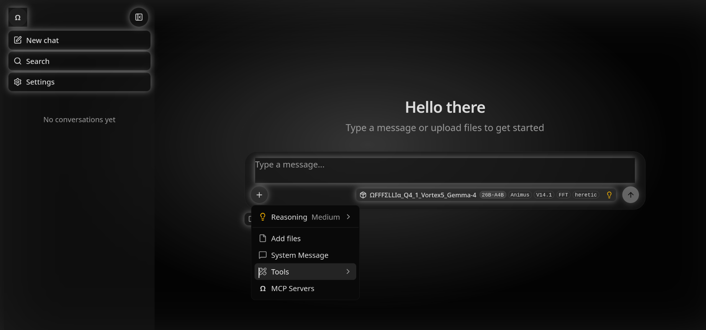
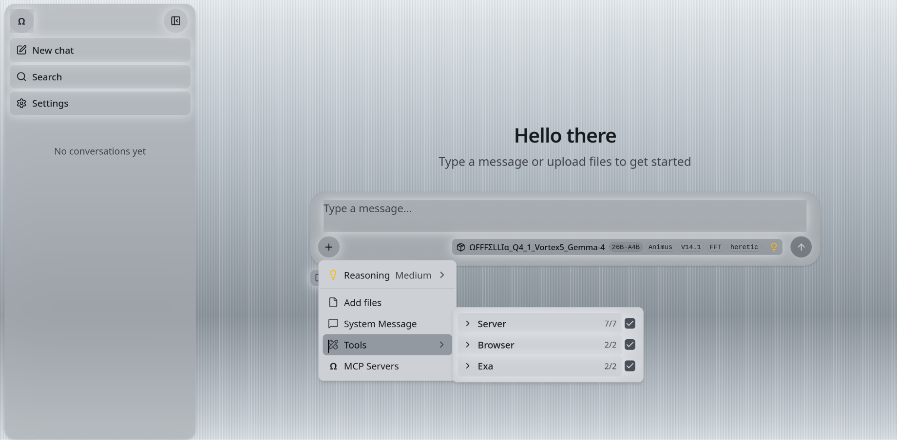

# ΩFFFΣLLIα llama.cpp

<div align="center">



<p align="center">
  
  
  
  
  
</p>

**Inferência de LLM em C/C++, com a interface Web construída a partir deste código.**

[](https://opensource.org/licenses/MIT)
[](https://github.com/ggml-org/llama.cpp)

[ggml](https://github.com/ggml-org/ggml) · [build](docs/build.md) · [server](tools/server/README.md) · [licença](LICENSE)

</div>

Árvore local de [llama.cpp](https://github.com/ggml-org/llama.cpp). O nome **ΩFFFΣLLIα llama.cpp** aparece no centro de qualquer página da interface, em qualquer porta do `llama-server`. Os logos SVG da interface foram substituídos pelo caractere **Ω**.

## Clonar e compilar

```bash
git clone https://github.com/brunoconta1980-tech/OFFFELLIA_llama.cpp_Neon_Themes.git
cd OFFFELLIA_llama.cpp_Neon_Themes

cmake -S . -B build
cmake --build build --target llama-server --parallel

./build/bin/llama-server -m modelo.gguf
```

É preciso um compilador C++, CMake, Node.js e npm. O CMake desta árvore liga a interface Vite e não baixa `dist.tar.gz`: na primeira compilação do servidor o npm instala `tools/ui` e o Vite gera os assets. Vulkan, CUDA e os outros backends ficam desligados até serem pedidos nesse `cmake`. O guia de cada backend está em [docs/build.md](docs/build.md).

## Modificações

| Área | Comportamento nesta árvore |
| --- | --- |
| Compilação | O CMake principal força `LLAMA_BUILD_UI=ON` e `LLAMA_USE_PREBUILT_UI=OFF`. Sempre que o servidor entra no build, o Vite compila `tools/ui` a partir do código local. Um cache antigo não reativa o download. |
| Atualização automática | A compilação não baixa `dist.tar.gz` nem consulta o Hugging Face. Não há checagem SHA-256 do pacote da interface. |
| PWA | O service worker não é registrado e não há aviso de versão nova. `sw.js`, manifest, Workbox e `version.json` não são exigidos para embutir a interface. |
| Favicon e SVG | `npm run build` é só `vite build`. O gerador de assets PWA não lê nem regrava `favicon.svg`. O HTML não declara favicon e o manifesto não lista ícones. |
| Logos | O logo da barra lateral e o logo MCP renderizam **Ω** no lugar do SVG. |
| Temas | Em **Theme** há cinco opções neon: Azul neon, Vermelho neon, Verde neon, Preto e cinza neon e Alumínio escovado. Cada uma troca a paleta e acende bordas, botões e o nome central. |
| MCP | O proxy CORS da interface (`--ui-mcp-proxy`) fica ligado por padrão. `--no-ui-mcp-proxy` desliga. Servidores MCP ainda pedem `--mcp-servers-config` ou `--mcp-servers-json`. As ferramentas de shell continuam desligadas sem `--tools` ou `--agent`. |
| gpt-oss-puzzle | A arquitetura entra em todo build do `libllama`. Não há opção de CMake para ligar ou desligar. `llama-quantize` aceita os tipos padrão. |

## gpt-oss-puzzle

O GGUF com `general.architecture = gpt-oss-puzzle` carrega, quantiza e entra no grafo desta árvore. O código está em `src/models/openai-moe-puzzle.cpp`. O CMake junta `models/*.cpp` com `CONFIGURE_DEPENDS`, no mesmo configure que já força a interface Vite (`LLAMA_BUILD_UI=ON`, `LLAMA_USE_PREBUILT_UI=OFF`). Um `cmake --build` seguinte vê o arquivo novo sem flag extra.

O modelo tem 36 camadas, 64 ou 128 experts por camada, e janelas de atenção 128, 0 (atenção cheia) e 8192. A cache SWA usa a maior janela. A camada de janela 128 divide essa cache com uma máscara mais curta.

`llama-quantize` aplica os tipos padrão da ferramenta: Q4_0, Q4_1, Q5_0, Q5_1, Q8_0, Q2_K, Q3_K_S, Q3_K_M, Q3_K_L, Q4_K_S, Q4_K_M, Q5_K_S, Q5_K_M, Q6_K, IQ4_NL, IQ4_XS, Q2_0, TQ1_0, TQ2_0, F16, BF16 e MXFP4_MOE. Experts que já estão em MXFP4 ou NVFP4 convertem para o tipo pedido sem `--allow-requantize`. Normas, bias e `ffn_gate_inp.weight` ficam em f32, que é a regra normal da ferramenta. IQ2_XXS, IQ2_XS, IQ3_XXS e Q2_K_S continuam pedindo imatrix.

As linhas têm 2880 colunas. Tipos de bloco 32 entram direto. Tipos de bloco 256 (Q2_K, Q3_K, Q4_K, Q5_K, Q6_K, IQ4_XS, TQ1_0, TQ2_0) gravam a linha com 3072 colunas, zeros no fim, e a inferência corta esse extra. `output.weight` segue a mistura padrão e vai para q6_K, salvo Q8_0 e MXFP4_MOE. Num Q4_K_M, as primeiras e as últimas camadas de `ffn_down` sobem para q6_K.

Nesta máquina, 15 GiB de RAM, use `--max-buffer-size 2048` para o tensor de expert não reservar a fatia padrão de 8 GiB. O contexto gravado no GGUF é 229376 tokens.

```bash
cmake -S . -B build
cmake --build build --target llama-quantize -j 6

./build/bin/llama-quantize --max-buffer-size 2048 \
  modelo-gpt-oss-puzzle.gguf saida.gguf Q4_K_M 8
```

A primeira compilação do servidor precisa de Node.js e npm, porque o Vite instala as dependências da interface e gera os assets embutidos.

Não exponha o `llama-server` fora da máquina enquanto o proxy MCP estiver ativo.

## Quick start

A few options to get `llama.cpp` installed on your machine:

```bash
# curl
curl -LsSf https://llama.app/install.sh | sh

# powershell
irm https://llama.app/install.ps1 | iex
```

- Visit https://llama.app and follow the instructions
- Run with Docker - see our [Docker documentation](docs/docker.md)
- Download pre-built binaries from the [releases page](https://github.com/ggml-org/llama.cpp/releases)
- Build from source by cloning this repository - check out [our build guide](docs/build.md)

Once installed:

```sh
# Download and run a model directly from Hugging Face
llama cli -hf ggml-org/Qwen3.5-0.8B-GGUF

# Launch OpenAI-compatible API server
llama serve -hf ggml-org/Qwen3.5-0.8B-GGUF
```

<table align="center">
    <tr>
        <td align="center" width=50%>
            
            <i>VLM session with <b>llama cli</b></i>
        </td>
        <td align="center">
            
            <i>Built-in web UI against <b>llama serve</b></i>
        </td>
    </tr>
<table>

## Description

The main goal of `llama.cpp` is to enable LLM (and VLM) inference with minimal setup and state-of-the-art performance on
a wide range of hardware - locally and in the cloud.

- Plain C/C++ implementation without any dependencies
- Apple silicon is a first-class citizen - optimized via ARM NEON, Accelerate and Metal frameworks
- AVX, AVX2, AVX512 and AMX support for x86 architectures
- RVV, ZVFH, ZFH, ZICBOP and ZIHINTPAUSE support for RISC-V architectures
- 1.5-bit, 2-bit, 3-bit, 4-bit, 5-bit, 6-bit, and 8-bit integer quantization for faster inference and reduced memory use
- Custom CUDA kernels for running LLMs on NVIDIA GPUs (support for AMD GPUs via HIP and Moore Threads GPUs via MUSA)
- Vulkan and SYCL backend support
- CPU+GPU hybrid inference to partially accelerate models larger than the total VRAM capacity

The `llama.cpp` project is build on top of the [ggml](https://github.com/ggml-org/ggml) library.

## Supported backends

| Backend | Target devices |
| --- | --- |
| [BLAS](docs/build.md#blas-build) | All |
| [BLIS](docs/backend/BLIS.md) | All |
| [CANN](docs/build.md#cann) | Ascend NPU |
| [CUDA](docs/build.md#cuda) | Nvidia GPU |
| [HIP](docs/build.md#hip) | AMD GPU |
| [Hexagon](docs/backend/snapdragon/README.md) | Snapdragon |
| [IBM zDNN](docs/backend/zDNN.md) | IBM Z & LinuxONE |
| [MUSA](docs/build.md#musa) | Moore Threads GPU |
| [Metal](docs/build.md#metal-build) | Apple Silicon |
| [OpenCL](docs/backend/OPENCL.md) | Adreno GPU |
| [OpenVINO [In Progress]](docs/backend/OPENVINO.md) | Intel CPUs, GPUs, and NPUs |
| [RPC](https://github.com/ggml-org/llama.cpp/tree/master/tools/rpc) | All |
| [SYCL](docs/backend/SYCL.md) | Intel GPU |
| [VirtGPU](docs/backend/VirtGPU.md) | VirtGPU APIR |
| [Vulkan](docs/build.md#vulkan) | GPU |
| [WebGPU](docs/build.md#webgpu) | All |
| [ZenDNN](docs/build.md#zendnn) | AMD CPU |

## Documentation

#### Tools

- [cli](tools/cli/README.md)
- [completion](tools/completion/README.md)
- [server](tools/server/README.md)
- [GBNF grammars](grammars/README.md)

#### Development

- [How to build](docs/build.md)
- [Running on Docker](docs/docker.md)
- [Build on Android](docs/android.md)
- [Multi-GPU usage](docs/multi-gpu.md)
- [Performance troubleshooting](docs/development/token_generation_performance_tips.md)
- [GGML tips & tricks](https://github.com/ggml-org/llama.cpp/wiki/GGML-Tips-&-Tricks)
- [XCFramework](docs/xcframework.md)
- [Completions](docs/completions.md)
- [Models](docs/models.md)
- [Release process](docs/release.md)

## Contributing

- Contributors can open PRs
- Collaborators will be invited based on contributions
- Maintainers can push to branches in the `llama.cpp` repo and merge PRs into the `master` branch
- Any help with managing issues, PRs and projects is very appreciated!
- Read the [CONTRIBUTING.md](CONTRIBUTING.md) for more information

## Acknowledgements

- [yhirose/cpp-httplib](https://github.com/yhirose/cpp-httplib) - Single-header HTTP server, used by `llama-server` - MIT license
- [nothings/stb](https://github.com/nothings/stb) - Single-header image format decoder, used by multimodal subsystem - Public domain
- [nlohmann/json](https://github.com/nlohmann/json) - Single-header JSON library, used by various tools/examples - MIT License
- [mackron/miniaudio](https://github.com/mackron/miniaudio) - Single-header audio format decoder, used by multimodal subsystem - Public domain
- [sheredom/subprocess.h](https://github.com/sheredom/subprocess.h) - Single-header process launching solution for C and C++ - Public domain
